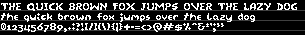
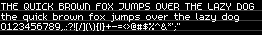
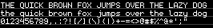
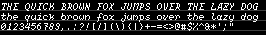
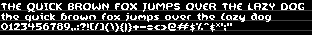

# Built-in Font Assets
| Predefined Variable | Ascent | Line Height | Bytes | Preview |
|---|---|---|---|---|
| `FONT_BR4` | 4 | 5 | 1963 |  |
| `FONT_SIMPLIPIXA` | 4 | 5 | 1950 |  |
| `FONT_PIXEL5` | 4 | 6 | 2035 |  |
| `FONT_BERKELIUM1541` | 5 | 6 | 2333 |  |
| `FONT_BR5` | 5 | 6 | 2117 |  |
| `FONT_BR5N` | 5 | 6 | 2110 |  |
| `FONT_BR5D` | 5 | 7 | 2140 |  |
| `FONT_CHUNKYSANS6` | 5 | 7 | 2349 |  |
| `FONT_BANGALOR` | 6 | 9 | 2200 |  |
| `FONT_CHUNKYSANS8` | 6 | 9 | 2421 |  |
| `FONT_ADAFRUIT` | 7 | 8 | 2535 |  |
| `FONT_FAITHLESS` | 7 | 10 | 2572 |  |
| `FONT_M5X7` | 7 | 10 | 2734 |  |
| `FONT_MONOGRAM` | 7 | 10 | 2786 |  |
| `FONT_MONOGRAMITALIC` | 7 | 10 | 2836 |  |
| `FONT_SCRAWL` | 7 | 10 | 3083 |  |
| `FONT_BSERIF` | 7 | 13 | 2425 |  |
| `FONT_BERKELIUM64` | 8 | 10 | 2638 |  |
| `FONT_VOLTER` | 8 | 10 | 2590 |  |
| `FONT_PIXELOIDSANS` | 8 | 11 | 3174 |  |
| `FONT_PIXELOIDSANSBOLD` | 8 | 11 | 3438 |  |
| `FONT_PIXOLLETTA` | 8 | 11 | 2924 |  |
| `FONT_SCIMONO` | 8 | 11 | 3107 |  |
| `FONT_LAIKA` | 8 | 12 | 3085 |  |
| `FONT_OLDSTYLE` | 8 | 12 | 3477 |  |
| `FONT_SLABSERIF` | 8 | 12 | 2481 |  |
| `FONT_PIXELGEORGIA` | 8 | 13 | 3440 |  |
| `FONT_PIXELGEORGIABOLD` | 8 | 13 | 3599 |  |
| `FONT_PIXELTIMES` | 8 | 13 | 3045 |  |
| `FONT_PIXELTIMESBOLD` | 8 | 13 | 3177 |  |
| `FONT_TUBEOFCORN` | 9 | 13 | 2720 |  |
| `FONT_UIBOLD` | 9 | 13 | 4102 |  |
| `FONT_BLACKLETTER` | 9 | 14 | 4478 |  |
| `FONT_RAINYHEARTS` | 9 | 14 | 3282 |  |
| `FONT_PIXCON` | 10 | 11 | 3695 |  |
| `FONT_UPHEAVAL` | 10 | 13 | 4118 |  |
| `FONT_GLASGOW` | 10 | 14 | 3955 |  |
| `FONT_UICONDENSED` | 10 | 14 | 2845 |  |
| `FONT_DUNGEON` | 10 | 15 | 3080 |  |
| `FONT_VENICE` | 10 | 15 | 3695 |  |
| `FONT_THIRDDIMENSION` | 11 | 16 | 5145 |  |
| `FONT_SIGNATURE` | 11 | 18 | 4606 |  |
| `FONT_BIRCHLEAF` | 12 | 17 | 3261 |  |
| `FONT_GOTHICPIXELS` | 12 | 17 | 3158 |  |
| `FONT_PIXDOR` | 12 | 17 | 3017 |  |
| `FONT_BLOCKKIE` | 16 | 24 | 5532 |  |
| `FONT_RETRON2000` | 21 | 27 | 9419 |  |
