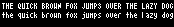

# Built-in Font Assets
| Predefined Variable | Line Height | Preview |
|---|---|---|
| `FONT_BR4` | 5 |  |
| `FONT_BERKELIUM1541` | 6 |  |
| `FONT_BR5` | 6 |  |
| `FONT_BR5N` | 6 |  |
| `FONT_BR6` | 7 |  |
| `FONT_LEXIS` | 8 |  |
| `FONT_ATARI` | 9 |  |
| `FONT_BANGALOR` | 10 |  |
| `FONT_BERKELIUM64` | 10 |  |
| `FONT_VOLTER` | 10 |  |
| `FONT_NOKIAFC` | 11 |  |
| `FONT_TUBEOFCORN` | 15 |  |
| `FONT_GOTHICPIXELS` | 17 |  |
| `FONT_BLOCKKIE` | 26 |  |
