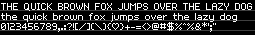

# Built-in Font Assets
| Predefined Variable | Ascent | Line Height | Bytes | Preview |
|---|---|---|---|---|
| `FONT_BR4` | 4 | 5 | 1963 |  |
| `FONT_SIMPLIPIXA` | 4 | 5 | 1950 |  |
| `FONT_BERKELIUM1541` | 5 | 6 | 2333 |  |
| `FONT_BR5` | 5 | 6 | 2117 |  |
| `FONT_BR5N` | 5 | 6 | 2110 |  |
| `FONT_BR6` | 5 | 7 | 2140 |  |
| `FONT_BANGALOR` | 6 | 9 | 2200 |  |
| `FONT_ADAFRUIT` | 7 | 8 | 2535 |  |
| `FONT_LEXIS` | 7 | 8 | 2577 |  |
| `FONT_NOKIAFC` | 7 | 9 | 2475 |  |
| `FONT_PIACEVOLI` | 7 | 11 | 2942 |  |
| `FONT_BERKELIUM64` | 8 | 10 | 2638 |  |
| `FONT_VOLTER` | 8 | 10 | 2590 |  |
| `FONT_PIXELOIDSANS` | 8 | 11 | 3174 |  |
| `FONT_PIXELOIDSANSBOLD` | 8 | 11 | 3438 |  |
| `FONT_PIXOLLETTA` | 8 | 11 | 2924 |  |
| `FONT_PIXELGEORGIA` | 8 | 13 | 3440 |  |
| `FONT_PIXELGEORGIABOLD` | 8 | 13 | 3599 |  |
| `FONT_PIXELTIMES` | 8 | 13 | 3045 |  |
| `FONT_PIXELTIMESBOLD` | 8 | 13 | 3177 |  |
| `FONT_TUBEOFCORN` | 9 | 13 | 2720 |  |
| `FONT_RAINYHEARTS` | 9 | 14 | 3282 |  |
| `FONT_PIXCON` | 10 | 11 | 3695 |  |
| `FONT_MITOCHONDRIA` | 10 | 13 | 2979 |  |
| `FONT_MONKEY` | 10 | 13 | 3966 |  |
| `FONT_ALKHEMIKAL` | 10 | 14 | 3791 |  |
| `FONT_KIWISODA` | 10 | 15 | 4053 |  |
| `FONT_VENICE` | 10 | 15 | 3695 |  |
| `FONT_CALAMITY` | 11 | 15 | 2899 |  |
| `FONT_PIXELLARI` | 11 | 15 | 3962 |  |
| `FONT_BIRCHLEAF` | 12 | 17 | 3261 |  |
| `FONT_GOTHICPIXELS` | 12 | 17 | 3158 |  |
| `FONT_PIXDOR` | 12 | 17 | 3017 |  |
| `FONT_CURSIVE` | 12 | 18 | 3395 |  |
| `FONT_BLOCKKIE` | 16 | 24 | 5532 |  |
| `FONT_RETRON2000` | 21 | 27 | 9419 |  |
