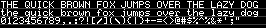

# Built-in Font Assets
| Predefined Variable | Line Height | Bytes | Preview |
|---|---|---|---|
| `FONT_BR4` | 5 | 2182 |  |
| `FONT_SIMPLIPIXA` | 5 | 2378 |  |
| `FONT_BERKELIUM1541` | 6 | 2475 |  |
| `FONT_BR5` | 6 | 2295 |  |
| `FONT_BR5N` | 6 | 2287 |  |
| `FONT_ADAFRUIT` | 8 | 2822 |  |
| `FONT_BR6` | 8 | 2249 |  |
| `FONT_LEXIS` | 8 | 2843 |  |
| `FONT_BANGALOR` | 10 | 2395 |  |
| `FONT_BERKELIUM64` | 10 | 2766 |  |
| `FONT_NOKIAFC` | 10 | 2620 |  |
| `FONT_PIACEVOLI` | 11 | 3634 |  |
| `FONT_PIXCON` | 11 | 4961 |  |
| `FONT_PIXOLLETTA` | 11 | 3607 |  |
| `FONT_VOLTER` | 11 | 2720 |  |
| `FONT_PIXELOIDSANS` | 12 | 3617 |  |
| `FONT_PIXELOIDSANSBOLD` | 12 | 3957 |  |
| `FONT_MONKEY` | 13 | 5063 |  |
| `FONT_MITOCHONDRIA` | 14 | 3245 |  |
| `FONT_PIXELGEORGIA` | 14 | 3525 |  |
| `FONT_PIXELGEORGIABOLD` | 14 | 4199 |  |
| `FONT_PIXELTIMES` | 14 | 3143 |  |
| `FONT_PIXELTIMESBOLD` | 14 | 3273 |  |
| `FONT_CALAMITY` | 16 | 5796 |  |
| `FONT_BIRCHLEAF` | 17 | 4549 |  |
| `FONT_GOTHICPIXELS` | 18 | 4941 |  |
| `FONT_PIXDOR` | 18 | 4553 |  |
| `FONT_RAINYHEARTS` | 18 | 4673 |  |
| `FONT_TUBEOFCORN` | 18 | 4289 |  |
| `FONT_BLOCKKIE` | 26 | 7924 |  |
| `FONT_RETRON2000` | 27 | 13478 |  |
