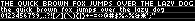
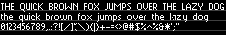

# Built-in Font Assets
| Predefined Variable | Line Height | Bytes | Preview |
|---|---|---|---|
| `FONT_BR4` | 5 | 1798 |  |
| `FONT_BERKELIUM1541` | 6 | 2310 |  |
| `FONT_BR5` | 6 | 2054 |  |
| `FONT_BR5N` | 6 | 2054 |  |
| `FONT_BR6` | 7 | 2054 |  |
| `FONT_ADAFRUIT` | 8 | 2310 |  |
| `FONT_LEXIS` | 8 | 2310 |  |
| `FONT_BANGALOR` | 10 | 3078 |  |
| `FONT_VOLTER` | 10 | 4870 |  |
| `FONT_NOKIAFC` | 11 | 4870 |  |
| `FONT_BERKELIUM64` | 12 | 5894 |  |
| `FONT_PIXELGEORGIA` | 13 | 6406 |  |
| `FONT_PIXELGEORGIABOLD` | 13 | 7430 |  |
| `FONT_PIXELTIMES` | 13 | 6918 |  |
| `FONT_PIXELTIMESBOLD` | 13 | 6918 |  |
| `FONT_TUBEOFCORN` | 15 | 6918 |  |
| `FONT_RAINYHEARTS` | 16 | 6406 |  |
| `FONT_GOTHICPIXELS` | 17 | 8454 |  |
| `FONT_BLOCKKIE` | 26 | 19206 |  |
| `FONT_RETRON2000` | 36 | 36614 |  |
